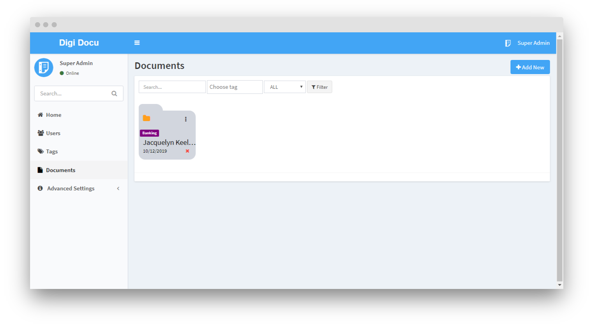
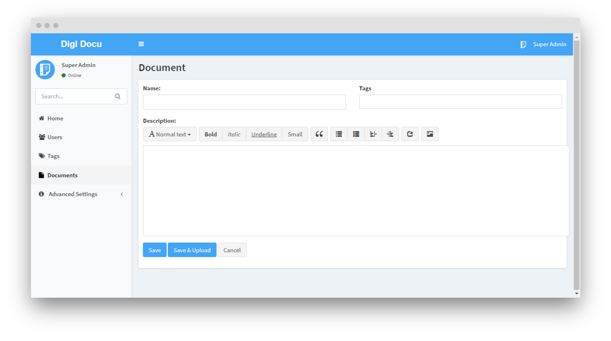

# Documents Management

Document is like physical file of your employee or just directory/folder for your personal
space. Inside document you can store all files of them. The document's label can be change 
from [settings](advanced-settings/settings.md).

## All Documents

 - **Search** - Search for document.
 - **Choose tag** - Filter by tags.
 - **Status** - Filter by document's status.
 
## New Document

Creating a document is not actual upload of files, is just like a creating a space
(i.e. employee information) or creating folder/directory for your documents.

 - **Name** - The name of document (i.e. employee name or folder name).
 - **Tags** - Select the tag corresponding to the current document.
 - **Description** - Additional information or remark or notes.

> **Note:** The additional or custom fields can be configured 
for the document from the [custom fields](advanced-settings/custom-fields.md) section.
