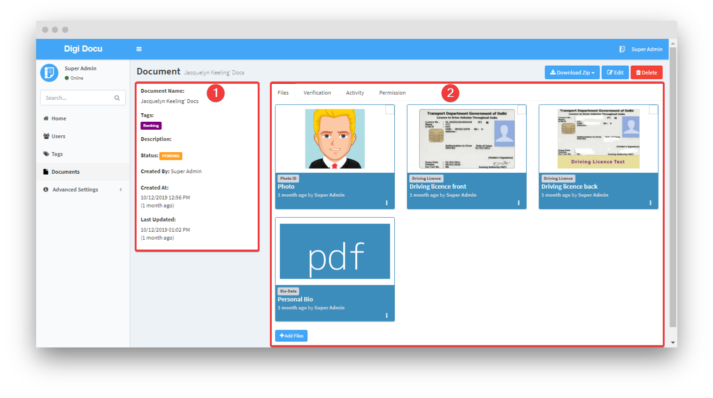
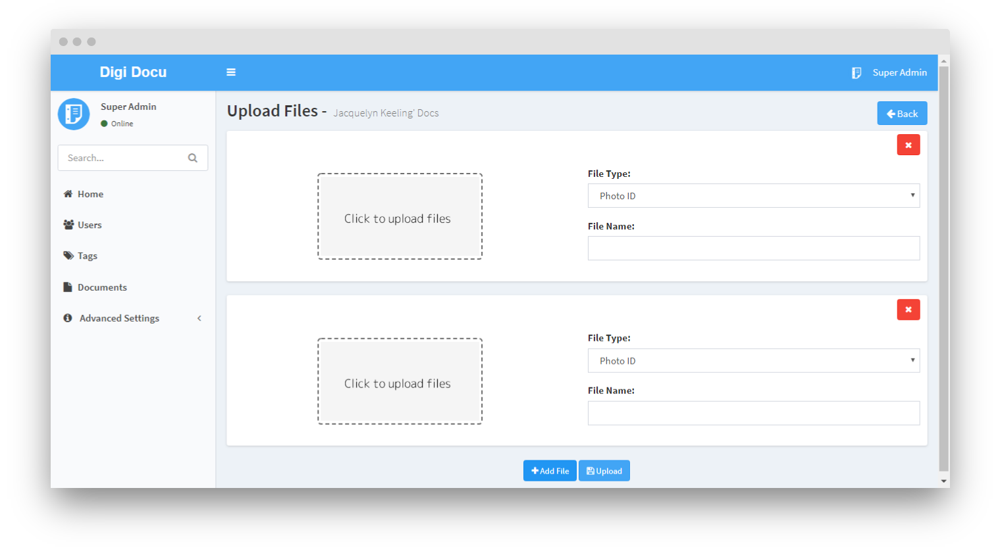
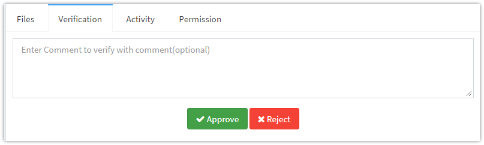
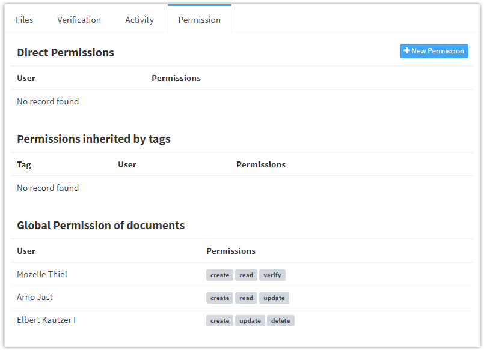

# File Uploads

To upload actual files for documents choose document from [documents](document-management.md)
and goto their detail page. The files's label can be change
from [settings](advanced-settings/settings.md).

1. The document detail.
2. Files uploaded to this document.

## Files
Click `Add Files` button to upload files.

 - **File Type** - The type of file(i.e address-proof).
 - **File Name** - The name of file.

You can upload multiple files at once. Click `Add File` to add block
for new file.
> **Note:** The additional or custom fields can be configured
for the files from the [custom fields](advanced-settings/custom-fields.md) section.

## Verification
The verification tab help to change status of document. The user with
permissions to verify document can approve/reject document.

## Activity
The activity tab shows each & every action performed on this document,
including file upload to verification.

## Permissions
The document level permissions can be given to user from permission tab.
read more about document level permissions from [permissions](permissions.md) section.

## Download & Edit Options
1. Download Zip
 -

## Merge images into pdf
