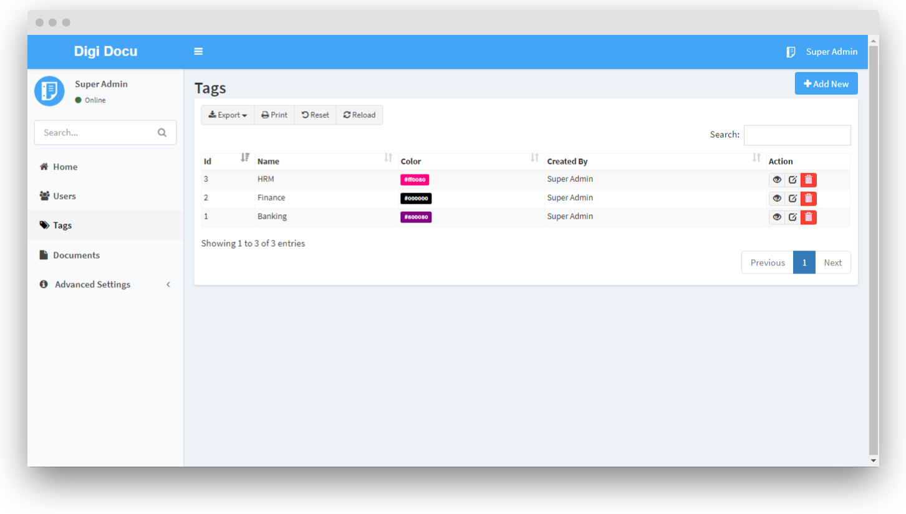
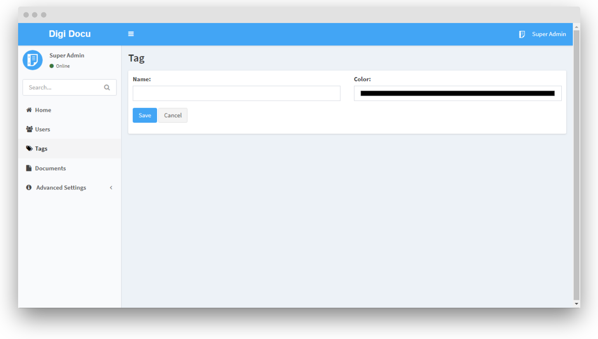

# Tags Management

Tags are treated as like departments or branches or just tags. 
tag's label can be changed in [settings](advanced-settings/settings.md) as per your requirements.

- **Name** - The name of the tag.
- **Color** - The color of the tag label.

> **Note:** The additional or custom fields can be configured 
for tags from the [custom fields](advanced-settings/custom-fields.md) section.
