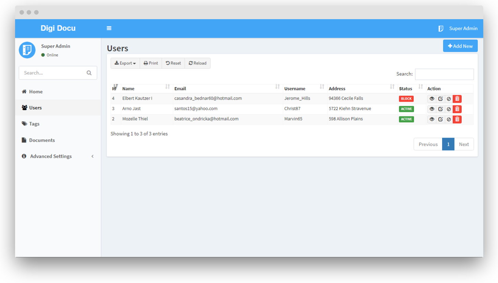
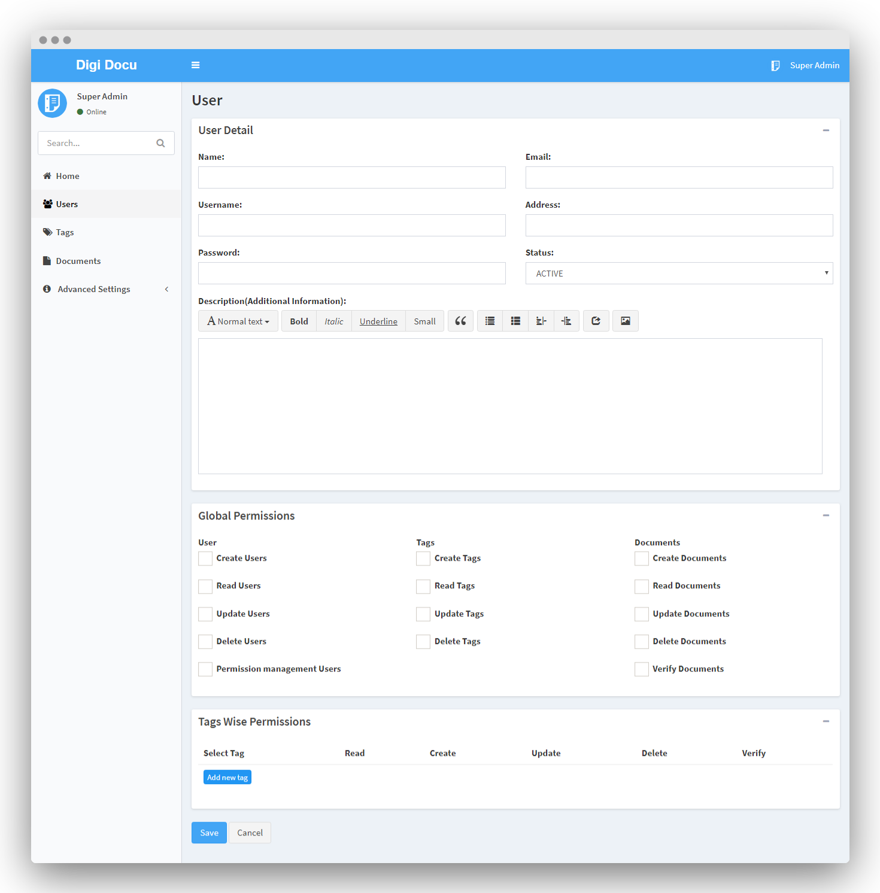

# User Management

- **User Detail** - Basic system user detail.
- **Global Permissions** - Global Permissions of user. 
- **Tags Wise Permissions** - Tag wise permissions of the user, what they can do
in the given tag. 
