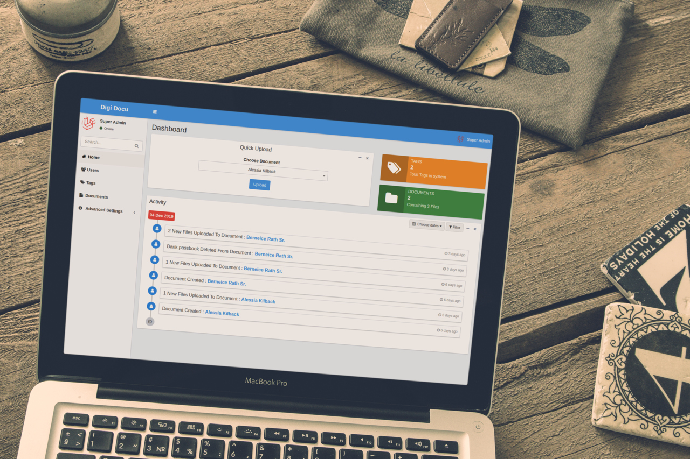

# DigiDocu
DigiDocu is a free, open source document management system built with laravel. Which provide easy way to 
manage documents with features like permissions, resize & compress images, combine multiple images into single pdf, 
zip all files etc..

## Installation
1. Download latest release from [here](#) or clone repository.
2. Run `composer install`.
3. Copy & setup `.env` file.
4. Create database & Change `DB_DATABASE` in `.env`.
5. Migrate the Database `php artisan migrate`.
6. Run `php artisan key:generate`
7. Run `php artisan db:seed` (This will generate super-admin & basic settings [required]).
8. Visit url in browser

##### Default Login Credential for super admin
| Username | Password |
|----------|----------|
| super    | 123456   |

## Documentation
1. [User Documentation](#)
2. [Developer Documentation](#)

## Contribution
 - Please explain your PR in clear language otherwise your PR may rejected.
 - Contribute to documentation in `public/docs` directory. 
 
## Licence
  - DigiDocu is primary licenced under [GPLv3 license](https://github.com/harish81/digidocu/blob/master/LICENSE).
  - For Enterprise licence contact us at [nandoliyaharish@gmail.com](mailto:nandoliyaharish@gmail.com) 

## Solutions
 - For Hosted Solutions contact us at [nandoliyaharish@gmail.com](mailto:nandoliyaharish@gmail.com)
